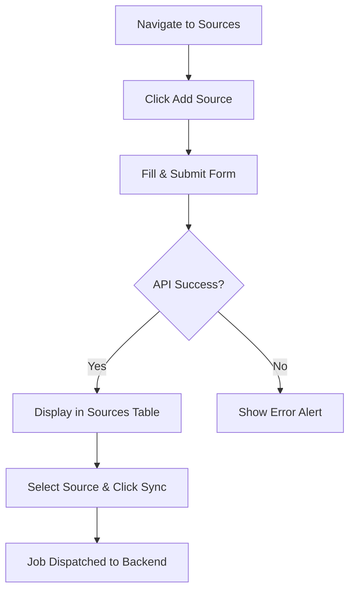
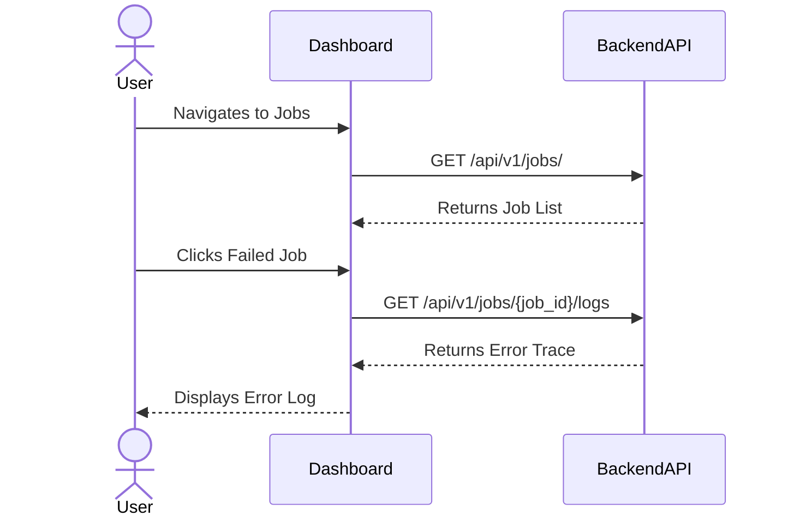
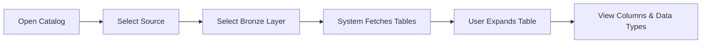
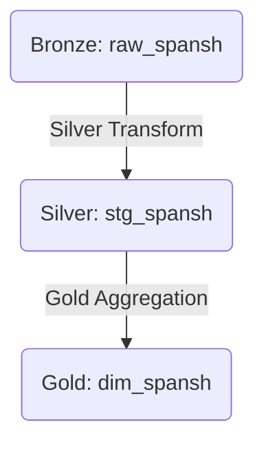

# Primary Elite Dashboard Userflows

This document outlines the core workflows a user will navigate within the Elite Dashboard to manage the Human-in-the-Loop (HitL) ETL pipeline.

## 1. Source Management & Sync Triggering

**Goal:** Register a new data provider and manually trigger the initial data extraction into the Bronze layer.

### Steps
*   User navigates to the Sources overview.
*   User clicks "Add New Source" and inputs the source name, target URL, and sync schedule.
*   User submits the form; the system registers the source.
*   User selects a registered source and clicks "Run Bronze Sync".
*   The system dispatches a background job and returns a Job ID.

### Necessary Displays
*   **Sources Table View:** Lists all registered sources with their status.
*   **Registration Modal/Form:** Form to input API/URL details.

### Flowchart


## 2. Job Monitoring

**Goal:** Track the execution status of ETL jobs and review logs for failures.

### Steps
*   User navigates to the Jobs dashboard.
*   User filters the list by "Running", "Failed", or "Success".
*   User selects a failed job to view details.
*   The system displays the direct PostgreSQL error log or Python stack trace.
*   User uses this information to correct their SQL templates.

### Necessary Displays
*   **Job History Table:** Sortable and filterable list of all jobs.
*   **Job Detail View/Drawer:** Expanding panel showing execution logs and metadata.

### Sequence Diagram


## 3. Schema Introspection (HitL Handshake)

**Goal:** Inspect the physical schema generated in the Bronze layer before writing transformations.

### Steps
*   User navigates to the Catalog.
*   User selects a specific data source and selects the "Bronze" layer.
*   System queries the database and displays the dynamically generated tables.
*   User expands a table to view specific column names and data types (e.g., `id64: bigint`).

### Necessary Displays
*   **Catalog Explorer Tree:** Hierarchical list of layers (Bronze/Silver/Gold) and tables.
*   **Schema Detail Panel:** Table showing Column Name and Data Type.

### Flowchart


## 4. HitL Transformation Editor

**Goal:** Write, validate, and submit SQL logic to promote data from Bronze to Silver, or Silver to Gold.

### Steps
*   User opens the Transformation Editor for a specific source.
*   User writes custom SQL (`CREATE TABLE AS SELECT...`).
*   User clicks "Dry Run".
*   System sends SQL to backend for validation inside a rollback transaction.
*   If error, system highlights the error.
*   If success, user clicks "Submit & Execute".
*   System saves the template to the filesystem and executes the promotion job.

### Necessary Displays
*   **Code Editor Component:** Syntax-highlighted SQL text area.
*   **Validation Console:** Output panel for Dry Run success/error messages.

### Sequence Diagram
```mermaid
sequenceDiagram
    actor User
    participant Editor
    participant BackendAPI
    participant Postgres
    
    User->>Editor: Writes SQL & Clicks Dry Run
    Editor->>BackendAPI: POST /api/v1/pipeline/silver/normalize (dry_run: true)
    BackendAPI->>Postgres: BEGIN; EXECUTE SQL; ROLLBACK;
    Postgres-->>BackendAPI: Validation Result
    BackendAPI-->>Editor: Success or DB Error
    Editor-->>User: Displays Result
    User->>Editor: Clicks Submit
    Editor->>BackendAPI: POST /api/v1/pipeline/silver/normalize (dry_run: false)
    BackendAPI-->>Editor: Saves Template & Starts Job
```

## 5. Data Lineage Visualization

**Goal:** Understand the dependency chain between raw data and aggregated business models.

### Steps
*   User navigates to the Lineage tab.
*   User selects a specific Gold table.
*   System traces the graph backwards, displaying the parent Silver and Bronze tables.

### Necessary Displays
*   **Interactive Node Graph:** Visual representation of tables as nodes and transformations as edges.

### Flowchart

